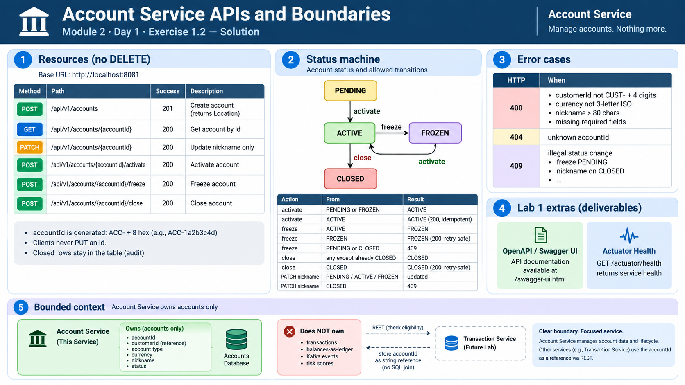

# Exercise 1.2 — solution

**Module 2** · Day 1 · Checkpoint B  
**Type:** design

Use this after you finish your own API sketch. Lab 1 implements this contract on port **8081**. Do not change URLs after this checkpoint.

## Answer



The diagram is the filled worksheet: resources with no DELETE, status transitions, 400/404/409, OpenAPI + Actuator, and Account owning accounts only.

### 1. Resources (no DELETE)

Base: `http://localhost:8081`

| Method | Path | Success |
| --- | --- | --- |
| POST | `/api/v1/accounts` | **201** Created + `Location` |
| GET | `/api/v1/accounts/{accountId}` | **200** |
| PATCH | `/api/v1/accounts/{accountId}` | **200** (nickname only) |
| POST | `/api/v1/accounts/{accountId}/activate` | **200** |
| POST | `/api/v1/accounts/{accountId}/freeze` | **200** |
| POST | `/api/v1/accounts/{accountId}/close` | **200** |

`accountId` is generated (`ACC-` + 8 hex). Clients never PUT an id. Closed rows stay in the table (audit).

### 2. Status machine

```text
PENDING --activate--> ACTIVE --freeze--> FROZEN
                         |                 |
                         | close           | activate
                         v                 |
                       CLOSED <------------+
```

| Action | From | Result |
| --- | --- | --- |
| activate | PENDING or FROZEN | ACTIVE |
| activate | ACTIVE | ACTIVE (**200**, idempotent) |
| freeze | ACTIVE | FROZEN |
| freeze | FROZEN | FROZEN (**200**, retry-safe) |
| freeze | PENDING or CLOSED | **409** |
| close | any except already CLOSED | CLOSED |
| close | CLOSED | CLOSED (**200**, retry-safe) |
| PATCH nickname | PENDING / ACTIVE / FROZEN | updated |
| PATCH nickname | CLOSED | **409** |

### 3. Error cases + Lab 1 extras

| HTTP | When |
| --- | --- |
| **400** | `customerId` not `CUST-` + 4 digits; currency not 3-letter ISO; nickname > 80 chars; missing required fields |
| **404** | unknown `accountId` |
| **409** | illegal status change (freeze PENDING, nickname on CLOSED, …) |

Lab 1 also ships **OpenAPI / Swagger UI** and **Actuator** `GET /actuator/health`. Those are deliverables, not extra services.

### 4. Bounded context

Account Service owns **accounts** only: `accountId`, `customerId`, type, currency, nickname, status.

It does **not** own transactions, balances-as-ledger, Kafka events, or risk scores. Transaction Service will store `accountId` as a **string reference** and check eligibility with REST, not a SQL join.

## Expected result (filled)

A one-page Account API sketch Lab 1 can implement without renaming paths. Freeze-from-PENDING is **409**. Retries of freeze / activate / close are **200**.
