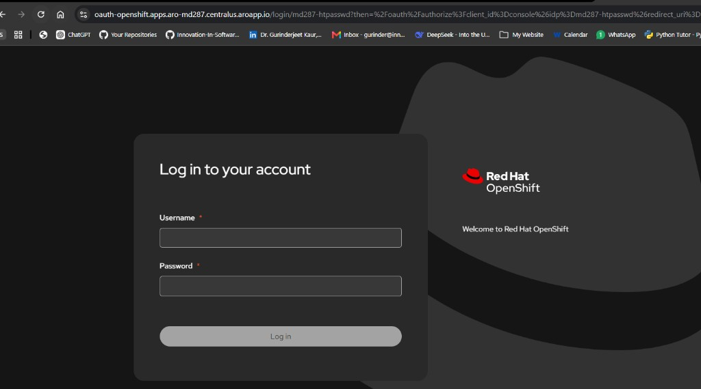
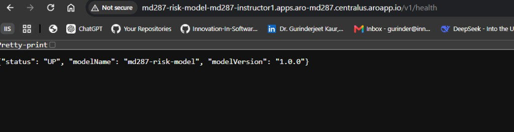
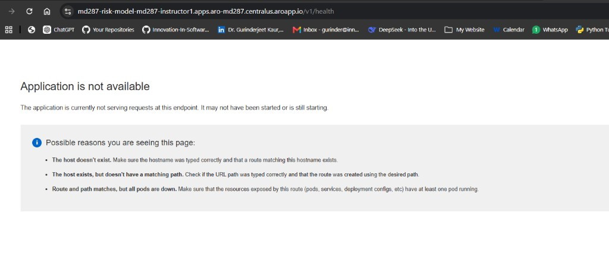
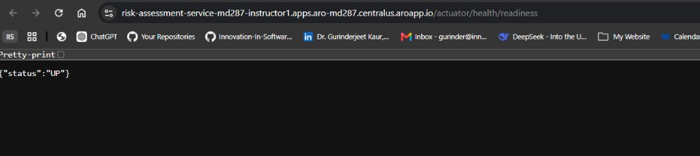

# Lab 5 — Risk Assessment Service

**Day:** 5 — OpenShift AI, MCP, and Capstone Completion  
**Capstone:** Service 3 of 3 in the AI-Assisted Banking Transaction Risk Platform  
**Time:** 90–120 minutes  
**Difficulty:** Beginner

**Objective:** Build **Risk Assessment Service**. Consume `TransactionSubmitted`, call the **pre-deployed OpenShift AI model** (auth, timeout, safe fallback), apply a **deterministic policy**, store an audit row in this service’s own database, complete a **human review**, **deploy to the assigned OpenShift project**, and capture capstone OpenShift evidence. MCP stays a design discussion — you do **not** run an MCP server today.

Do **not** copy from a `solution/` folder. The participant pack does not include one. `ModelClient` and `AssessmentService` are already complete. You finish **`PolicyEngine`** and **`SecurityConfig`**.

---

## What you will finish with

By the end of this lab you will have:

- Risk Assessment Service on port **8083**
- Its **own** database (`risk_db` on host port **5435**)
- A consumer on Kafka topic `transactions.submitted` (group `risk-assessment-service`)
- Model calls to the **pre-deployed OpenShift AI** endpoint (same contract as the local stand-in on **8090**)
- Policy outcomes **APPROVE**, **HOLD**, **DECLINE**
- Model timeout or HTTP 500 → **HOLD** `MODEL_UNAVAILABLE` (never auto-APPROVE)
- Human review on HOLD only (`risk.write`); ops can read (`risk.read`) but cannot review
- Audit fields: model name/version, score, policy version, correlation id
- Risk Assessment **deployed** to your assigned OpenShift project (Route readiness **200**)
- Exercise 5.3 MCP worksheet walked (no MCP server)

---

## Knowledge you need (from Day 5)

| Day 5 idea | How it appears in this lab |
| --- | --- |
| **Model endpoint** | `ModelClient` POST with Bearer API key. Local stand-in `:8090` for coding; **required** call to the pre-deployed OpenShift AI Route (`MD287_MODEL_ROUTE`). |
| **Safe fallback** | Timeout or 5xx → HOLD, not APPROVE |
| **Deterministic policy** | Java `PolicyEngine` owns APPROVE / HOLD / DECLINE |
| **Human review** | HOLD rows stay `PENDING` until a reviewer posts APPROVE or DECLINE |
| **Audit** | Persist `modelName`, `modelVersion`, `modelScore`, `policyVersion`, `correlationId` |
| **MCP** | Walk Exercise 5.3 worksheet (already filled) — auth, HITL, audit. No MCP server. |
| **GitHub Copilot Free** | Already on this VM. Copilot may draft `PolicyEngine` if/else — **review before accept**; tests must prove the table. |
| **runAsUser 100** | Named `USER md287` is not enough on ARO. Keep `runAsNonRoot` and set uid **100**. |

### Policy table (`policy-v1`)

| Condition (first match wins) | Disposition | Reason |
| --- | --- | --- |
| Model not `OK` | HOLD | `MODEL_UNAVAILABLE` |
| Amount ≥ 5000 | HOLD | `HIGH_VALUE` |
| Score ≥ 70 | DECLINE | `HIGH_SCORE` |
| Score < 40 **and** amount < 1000 | APPROVE | `LOW_SCORE_LOW_VALUE` |
| Anything else | HOLD | `REVIEW_BAND` |

Use the injected `Md287Properties.Policy` thresholds. Do **not** hard-code `40`, `70`, or `5000` in the if-statements.

### Who can call what

| Token (`tools/issue-jwt.py`) | GET assessments | POST review |
| --- | --- | --- |
| `ops` — includes `risk.read` | 200 | **403** |
| `reviewer` — `risk.read risk.write` | 200 | 200 on HOLD |
| `teller` | **403** | **403** |
| no token | **401** | **401** |

Health stays public. Lab 3 `ops` does **not** include `risk.read` — use **Lab 5** `issue-jwt.py`.

---

## Environment basics (read this first)

Do **all** of this **on the Ablaze VM**. Your laptop is only the browser. Copy **one block at a time**. Do not paste two commands on the same line. Do **not** paste this whole guide (or a chat) into the terminal.

**Where this lab sits:** Lab 4 already deployed Account and Transaction on ARO. Today you add Risk Assessment (service 3), call the **pre-deployed** model Route, then deploy Risk. Capstone evidence is Risk Route readiness **200** plus Lab 4 rollback.

**Repo root (from Lab 0):** `%USERPROFILE%\MD287`. Example: `C:\Users\student.VLAB\MD287`. Do **not** clone. Do **not** run `mklink`. If the prompt shows the long `.vscode\...-participant` path, that is the same repo — `cd` to `MD287` before git commands.

Work in `labs\day-05\lab5\starter\risk-assessment-service`.

| Task | How |
| --- | --- |
| Folder | **File → Open Folder** → `%USERPROFILE%\MD287` |
| Terminal 1 | Compose / Maven `spring-boot:run` / `oc` / Docker build |
| Terminal 2 | `curl.exe`, `python tools\issue-jwt.py`, `publish-event.ps1` |
| HTTP | **`curl.exe`** (not `curl`). On OpenShift Routes use **`curl.exe -k`** (classroom certificate). |
| Tokens | From `labs\day-05\lab5`: `$OPS = (python tools\issue-jwt.py ops).Trim()` |
| Stop older labs first | Labs 2–4 bind **9092**. Stop those stacks before Lab 5 Kafka. |
| GitHub Copilot | Signed in during Lab 0. Review before accept. |

**You need:** Java 21, Maven 3.9+, Docker Desktop, Python 3, **OpenShift `oc`**, and classroom `oc login` to your assigned project. Finish Labs 1–4 first so you can show the capstone chain.

| Cluster item | Value |
| --- | --- |
| API | `https://api.aro-md287.centralus.aroapp.io:6443/` |
| OpenShift username | `student01` … `student25` from the instructor. **Not** `student.VLAB`. **Not** `MSMICR26-26`. |
| OpenShift project | `md287-student01` (same number as your OpenShift username) |
| Password | Class password from the instructor. Do not use `MSMICR26-TD`. |
| Image registry | `default-route-openshift-image-registry.apps.aro-md287.centralus.aroapp.io` |
| Model Route | `http://md287-risk-model-<project>.apps.aro-md287.centralus.aroapp.io` |

**Port map:**

| Process | Host port |
| --- | --- |
| Risk Assessment Service | 8083 |
| Risk Postgres | 5435 |
| Kafka | 9092 |
| Mock model (OpenShift AI stand-in) | 8090 |

---

## Steps from the training slides

Follow these steps in order. Finish one step before starting the next.

### Step 0 — Pull the latest repo

Get the latest Lab 5 guide and starter from GitHub. Do **not** clone. Do **not** run `mklink`.

```powershell
cd $env:USERPROFILE\MD287
git pull
```

**Expected:** `Already up to date.` or a Fast-forward. Prompt ends with `\MD287>`.

Then: **File → Open Folder** → `%USERPROFILE%\MD287` if it is not already open.

`git pull` only works **inside** the repo. Do not run it from `C:\Users\student.VLAB`.

### Step 1 — Stop older labs, confirm the model Route, start backing services

**Do this:**

1. Stop leftover Maven (**Ctrl+C**, then **`Y`** in any `spring-boot:run` tab). Then stop Lab 1–4 Compose so port **9092** is free:

```powershell
cd "$env:USERPROFILE\MD287\labs\day-01\lab1\starter\account-service"
docker compose down
cd "$env:USERPROFILE\MD287\labs\day-02\lab2\starter\transaction-service"
docker compose down
cd "$env:USERPROFILE\MD287\labs\day-03\lab3\starter\account-service"
docker compose down
cd "$env:USERPROFILE\MD287\labs\day-03\lab3\starter\transaction-service"
docker compose down
cd "$env:USERPROFILE\MD287\labs\day-04\lab4\starter"
docker compose down
```

If a port is still busy:

```powershell
foreach ($port in 8083, 5435, 8090, 9092) {
  $p = (Get-NetTCPConnection -LocalPort $port -State Listen -ErrorAction SilentlyContinue | Select-Object -First 1).OwningProcess
  if ($p) { Stop-Process -Id $p -Force; "Stopped PID $p on $port" } else { "$port is free" }
}
docker ps
```

2. Log in to OpenShift. Get **your OpenShift** username (`student01` … `student25`) and the class password from the instructor. This is **not** the Ablaze id `MSMICR26-26` and **not** `student.VLAB`. Do not use `MSMICR26-TD`. If you already logged in during Lab 4, `oc whoami` may already work.

```powershell
oc login https://api.aro-md287.centralus.aroapp.io:6443/
```

At the prompts type your **OpenShift** username (example `student12`) and the class password. Same console login as Lab 4:



Then:

```powershell
oc whoami
oc project md287-student12
oc project -q
```

Change `md287-student12` to **your** number (username `student12` → project `md287-student12`).

**Expected:** `oc whoami` prints `student12` (your number). `oc project -q` prints `md287-student12`. If login fails or the project is Forbidden, **stop** — get the instructor.

3. Confirm the classroom model Route (HTTP, **no trailing slash**):

```powershell
$env:MD287_MODEL_ROUTE = "http://md287-risk-model-$(oc project -q).apps.aro-md287.centralus.aroapp.io"
curl.exe -s "$env:MD287_MODEL_ROUTE/v1/health"
```

**Expected result:** JSON includes `"status":"UP"` and a model name/version:

```text
{"status": "UP", "modelName": "md287-risk-model", "modelVersion": "1.0.0"}
```

Open the **http** URL in a browser (the address bar must show **Not secure** / `http://`, not a padlock). Chrome often upgrades to https — that fails (next screenshot).



If you see **Application is not available**, you used **https**. The model Route has **no TLS**. Change the URL to `http://` and retry. Do **not** treat this as a down pod.



If HTTP also fails, **stop** for the cluster path — the model must be pre-deployed. Do not invent scores in Java. You can still code against the **local mock** in the next command, but you cannot skip the OpenShift deploy later.

4. Start Lab 5 Compose (local Kafka, `risk_db`, and a **same-contract** mock on **8090**):

```powershell
cd "$env:USERPROFILE\MD287\labs\day-05\lab5\starter"
docker compose up -d
Start-Sleep -Seconds 25
docker compose ps
curl.exe -s http://localhost:8090/v1/health
```

Wait until `md287-lab5-kafka-init` has **exited** (topics created). If status is still `starting`, wait 15 seconds and run `docker compose ps` again.

**Expected result:** mock health JSON includes `"status":"UP"`. `risk-db` and `kafka` are running. `kafka-init` exited.

**Why this matters:** You treat the model as an untrusted remote: timeout, `Authorization: Bearer` API key, no raw key in logs. The local mock matches the OpenShift AI Route so PolicyEngine tests can run before you deploy.

---

### Step 2 — Confirm the starter still refuses to assess

```powershell
cd "$env:USERPROFILE\MD287\labs\day-05\lab5\starter\risk-assessment-service"
mvn test
```

**Expected result:** `PolicyEngineTest` fails with `UnsupportedOperationException` / TODO. `AssessmentServiceTest.modelTimeoutStoresHold` also fails until Step 3 (it constructs a real `PolicyEngine`). `AssessmentSecurityTest` fails until Step 5. Duplicate-event and review tests can already pass. That is expected. Do **not** copy a `solution/` tree.

**Why this matters:** The red tests are the spec. Green tests after you paste are the proof.

---

### Step 3 — Implement `PolicyEngine` (Exercise 5.2)

Replace the TODO. Use `policy.holdAmountAtOrAbove()`, `policy.declineScoreAtOrAbove()`, `policy.approveScoreBelow()`, and `policy.approveAmountBelow()`. GitHub Copilot (Free, already on this VM) may draft the if/else. **Review before accept.** Reject any suggestion that auto-APPROVEs when the model is down.

**Do this:**

```powershell
cd "$env:USERPROFILE\MD287\labs\day-05\lab5\starter\risk-assessment-service"
@'
package com.md287.risk.policy;

import com.md287.risk.config.Md287Properties;
import com.md287.risk.domain.Disposition;
import com.md287.risk.domain.ModelStatus;
import com.md287.risk.model.ModelScore;
import org.springframework.stereotype.Component;

import java.math.BigDecimal;

@Component
public class PolicyEngine {

    private final Md287Properties.Policy policy;

    public PolicyEngine(Md287Properties properties) {
        this.policy = properties.policy();
    }

    public PolicyDecision decide(BigDecimal amount, ModelScore model) {
        if (model.status() != ModelStatus.OK) {
            return new PolicyDecision(Disposition.HOLD, "MODEL_UNAVAILABLE");
        }
        if (amount.compareTo(policy.holdAmountAtOrAbove()) >= 0) {
            return new PolicyDecision(Disposition.HOLD, "HIGH_VALUE");
        }
        if (model.score() >= policy.declineScoreAtOrAbove()) {
            return new PolicyDecision(Disposition.DECLINE, "HIGH_SCORE");
        }
        if (model.score() < policy.approveScoreBelow()
                && amount.compareTo(policy.approveAmountBelow()) < 0) {
            return new PolicyDecision(Disposition.APPROVE, "LOW_SCORE_LOW_VALUE");
        }
        return new PolicyDecision(Disposition.HOLD, "REVIEW_BAND");
    }
}
'@ | Set-Content -Encoding ascii "src\main\java\com\md287\risk\policy\PolicyEngine.java"
Select-String -Path "src\main\java\com\md287\risk\policy\PolicyEngine.java" -Pattern "TODO|MODEL_UNAVAILABLE|holdAmountAtOrAbove"
```

Need `MODEL_UNAVAILABLE` and `holdAmountAtOrAbove`. **No** `TODO`.

```powershell
mvn -Dtest=PolicyEngineTest test
```

**Expected result:** Tests run: **5**, Failures: **0**. APPROVE, HIGH_SCORE, HIGH_VALUE, MODEL_UNAVAILABLE, and REVIEW_BAND cases pass.

**Why this matters:** The model may suggest a number. **Policy** decides money movement. A high-value payment with a low score still goes to a human.

---

### Step 4 — Confirm the safe model fallback

`ModelClient` is already complete. Confirm the `catch` blocks return `timeout()` / `unavailable()` and **never** invent a score. If Copilot suggests `return ModelScore.ok(...)` in a catch block, reject it.

```powershell
cd "$env:USERPROFILE\MD287\labs\day-05\lab5\starter\risk-assessment-service"
Select-String -Path "src\main\java\com\md287\risk\model\ModelClient.java" -Pattern "catch|timeout|unavailable|ModelScore.ok"
Select-String -Path "src\main\java\com\md287\risk\config\RestClientConfig.java" -Pattern "JdkClientHttpRequestFactory"
```

Need `return ModelScore.timeout()` and `return ModelScore.unavailable()` inside `catch`. Need `JdkClientHttpRequestFactory` (Content-Length). `ModelScore.ok` belongs on the **success** path only.

`AssessmentService` already calls `policyEngine.decide` with that result so a timeout becomes HOLD.

```powershell
mvn -Dtest=AssessmentServiceTest test
```

**Expected result:** Tests run: **3**, Failures: **0**. `modelTimeoutStoresHold` passes. Duplicate `eventId` does not call the model again.

**Why this matters:** Same rule as Lab 3: failure is not “assume it is fine.” Java `SimpleClientHttpRequestFactory` often sends chunked POST bodies; the classroom Python mock would then see `{}` and score **0** (everything APPROVE). This lab already uses `JdkClientHttpRequestFactory`.

---

### Step 5 — Protect the API (scopes)

GET `/api/v1/assessments/**` needs `SCOPE_risk.read`. POST `/*/review` needs `SCOPE_risk.write`. Actuator health/info stay public.

**Do this:**

```powershell
cd "$env:USERPROFILE\MD287\labs\day-05\lab5\starter\risk-assessment-service"
@'
package com.md287.risk.config;

import com.fasterxml.jackson.databind.ObjectMapper;
import org.springframework.boot.context.properties.EnableConfigurationProperties;
import org.springframework.context.annotation.Bean;
import org.springframework.context.annotation.Configuration;
import org.springframework.http.HttpMethod;
import org.springframework.security.config.annotation.web.builders.HttpSecurity;
import org.springframework.security.config.http.SessionCreationPolicy;
import org.springframework.security.oauth2.jose.jws.MacAlgorithm;
import org.springframework.security.oauth2.jwt.JwtDecoder;
import org.springframework.security.oauth2.jwt.NimbusJwtDecoder;
import org.springframework.security.web.SecurityFilterChain;

import javax.crypto.spec.SecretKeySpec;
import java.nio.charset.StandardCharsets;

@Configuration
@EnableConfigurationProperties(JwtProperties.class)
public class SecurityConfig {

    @Bean
    JwtDecoder jwtDecoder(JwtProperties properties) {
        byte[] secret = properties.secret().getBytes(StandardCharsets.UTF_8);
        SecretKeySpec key = new SecretKeySpec(secret, "HmacSHA256");
        return NimbusJwtDecoder.withSecretKey(key).macAlgorithm(MacAlgorithm.HS256).build();
    }

    @Bean
    SecurityFilterChain securityFilterChain(HttpSecurity http, ObjectMapper objectMapper) throws Exception {
        return http
                .csrf(csrf -> csrf.disable())
                .sessionManagement(session -> session.sessionCreationPolicy(SessionCreationPolicy.STATELESS))
                .authorizeHttpRequests(auth -> auth
                        .requestMatchers("/actuator/health", "/actuator/health/**", "/actuator/info").permitAll()
                        .requestMatchers("/v3/api-docs/**", "/swagger-ui/**", "/swagger-ui.html").permitAll()
                        .requestMatchers(HttpMethod.GET, "/api/v1/assessments/**").hasAuthority("SCOPE_risk.read")
                        .requestMatchers(HttpMethod.POST, "/api/v1/assessments/*/review").hasAuthority("SCOPE_risk.write")
                        .anyRequest().authenticated()
                )
                .oauth2ResourceServer(oauth2 -> oauth2
                        .jwt(jwt -> {
                        })
                        .authenticationEntryPoint(SecurityJsonHandlers.unauthorized(objectMapper))
                        .accessDeniedHandler(SecurityJsonHandlers.forbidden(objectMapper))
                )
                .build();
    }
}
'@ | Set-Content -Encoding ascii "src\main\java\com\md287\risk\config\SecurityConfig.java"
Select-String -Path "src\main\java\com\md287\risk\config\SecurityConfig.java" -Pattern "TODO|SCOPE_risk.read|SCOPE_risk.write"
```

Need both scopes. **No** `TODO`.

```powershell
mvn -Dtest=AssessmentSecurityTest test
mvn test
```

**Expected result:** `AssessmentSecurityTest` — Tests run: **2**, Failures: **0**. Full `mvn test` — Tests run: **10**, Failures: **0**. 401 without a token. 403 with `risk.read` on review.

**Why this matters:** Ops can see the HOLD queue. Only a reviewer can clear it. The model must never post `/review`.

---

### Step 6 — Run the service and publish sample events

**Terminal 1** — leave this running:

```powershell
cd "$env:USERPROFILE\MD287\labs\day-05\lab5\starter\risk-assessment-service"
mvn spring-boot:run
```

Wait until the log shows Tomcat on **8083** and a Kafka consumer joined `transactions.submitted`.

**Terminal 2:**

```powershell
curl.exe -s http://localhost:8083/actuator/health/readiness
```

Need `"status":"UP"` (or `{"status":"UP",...}`).

Issue Lab 5 tokens (keep this window so `$OPS` / `$REVIEWER` stay set). Use **`.Trim()`** so a trailing newline does not break `curl.exe`.

```powershell
cd "$env:USERPROFILE\MD287\labs\day-05\lab5"
$OPS = (python tools\issue-jwt.py ops).Trim()
$REVIEWER = (python tools\issue-jwt.py reviewer).Trim()
$TELLER = (python tools\issue-jwt.py teller).Trim()
"ops length=$($OPS.Length) reviewer length=$($REVIEWER.Length) teller length=$($TELLER.Length)"
```

Publish the five sample events. Work from `labs\day-05\lab5` so the script can reach container `md287-lab5-kafka`.

```powershell
cd "$env:USERPROFILE\MD287\labs\day-05\lab5"
powershell -File tools\publish-event.ps1 -File tools\events\approve.json
powershell -File tools\publish-event.ps1 -File tools\events\hold.json
powershell -File tools\publish-event.ps1 -File tools\events\decline.json
powershell -File tools\publish-event.ps1 -File tools\events\timeout.json
powershell -File tools\publish-event.ps1 -File tools\events\high-value.json
Start-Sleep -Seconds 5
```

**Expected:** each command prints `Published tools\events\....json to transactions.submitted`. Timeout takes a few extra seconds (the mock sleeps 10s; the client times out at 3s).

GET the rows (use **these** transaction ids — they are in the sample files):

```powershell
curl.exe -s -H "Authorization: Bearer $OPS" http://localhost:8083/api/v1/assessments/TXN-A1B2C3D4
curl.exe -s -H "Authorization: Bearer $OPS" http://localhost:8083/api/v1/assessments/TXN-B2C3D4E5
curl.exe -s -H "Authorization: Bearer $OPS" http://localhost:8083/api/v1/assessments/TXN-C3D4E5F6
curl.exe -s -H "Authorization: Bearer $OPS" http://localhost:8083/api/v1/assessments/TXN-D4E5F6A7
curl.exe -s -H "Authorization: Bearer $OPS" http://localhost:8083/api/v1/assessments/TXN-E5F6A7B8
curl.exe -s -H "Authorization: Bearer $OPS" "http://localhost:8083/api/v1/assessments?disposition=HOLD"
```

**Expected result:**

| File | transactionId | Disposition | Reason |
| --- | --- | --- | --- |
| approve.json | `TXN-A1B2C3D4` | APPROVE | `LOW_SCORE_LOW_VALUE` |
| hold.json | `TXN-B2C3D4E5` | HOLD | `REVIEW_BAND` |
| decline.json | `TXN-C3D4E5F6` | DECLINE | `HIGH_SCORE` |
| timeout.json | `TXN-D4E5F6A7` | HOLD | `MODEL_UNAVAILABLE` |
| high-value.json | `TXN-E5F6A7B8` | HOLD | `HIGH_VALUE` |

No token → **401**. Teller token → **403** on GET:

```powershell
curl.exe -s -w "`nHTTP:%{http_code}`n" http://localhost:8083/api/v1/assessments/TXN-A1B2C3D4
curl.exe -s -w "`nHTTP:%{http_code}`n" -H "Authorization: Bearer $TELLER" http://localhost:8083/api/v1/assessments/TXN-A1B2C3D4
```

Publish `approve.json` a second time. Logs in Terminal 1 show duplicate ignored. One row in the database:

```powershell
powershell -File tools\publish-event.ps1 -File tools\events\approve.json
Start-Sleep -Seconds 2
curl.exe -s -H "Authorization: Bearer $OPS" http://localhost:8083/api/v1/assessments/TXN-A1B2C3D4
```

Write the review body to a **file**. Do **not** paste JSON with `` `{`"decision`":... `` — PowerShell 5.1 breaks that.

```powershell
cd "$env:USERPROFILE\MD287\labs\day-05\lab5"
New-Item -ItemType Directory -Force -Path tools\requests | Out-Null
@'
{"decision":"APPROVE","reason":"false positive on synthetic lab traffic"}
'@ | Set-Content -Encoding ascii tools\requests\review-approve.json
```

Review the HOLD from `hold.json` (`TXN-B2C3D4E5`):

```powershell
curl.exe -s -w "`nHTTP:%{http_code}`n" `
  -H "Authorization: Bearer $REVIEWER" `
  -H "Content-Type: application/json" `
  --data-binary "@tools\requests\review-approve.json" `
  http://localhost:8083/api/v1/assessments/TXN-B2C3D4E5/review
```

**Expected:** **HTTP:200**, `reviewStatus=COMPLETED`, `disposition=APPROVE`.

Same POST with `$OPS` is **403**. Reviewing an already-APPROVE row is **409** `REVIEW_NOT_ALLOWED`:

```powershell
curl.exe -s -w "`nHTTP:%{http_code}`n" `
  -H "Authorization: Bearer $OPS" `
  -H "Content-Type: application/json" `
  --data-binary "@tools\requests\review-approve.json" `
  http://localhost:8083/api/v1/assessments/TXN-B2C3D4E5/review

curl.exe -s -w "`nHTTP:%{http_code}`n" `
  -H "Authorization: Bearer $REVIEWER" `
  -H "Content-Type: application/json" `
  --data-binary "@tools\requests\review-approve.json" `
  http://localhost:8083/api/v1/assessments/TXN-A1B2C3D4/review
```

Need **HTTP:403** then **HTTP:409**.

In Terminal 1 logs: `transactionId=`, `correlationId=lab5-demo-...`. No `Authorization`, no API key.

**Why this matters:** Sample JSON **is** the `TransactionSubmitted` contract. Ops can watch the queue; a reviewer clears HOLD. The model does not mark its own homework.

---

### Step 7 — Optional: live event from Transaction Service

Sample JSON files use the **`TransactionSubmitted`** vocabulary (event id, correlation id, amount). That is **required** and already done in Step 6.

To take a **live** event from Transaction Service (same topic), only if you finished early **and** the instructor says to share Kafka:

1. Stop Lab 5 Kafka only. Keep Lab 5 extras:

```powershell
cd "$env:USERPROFILE\MD287\labs\day-05\lab5\starter"
docker compose down
docker compose up -d risk-db mock-model
```

2. Start Lab 3 (or Lab 4 Compose) so Account **8081**, Transaction **8082**, and Kafka **9092** are up. POST a transaction with a **Lab 3** ops token (`accounts.read transactions.read transactions.write`).

3. Restart Risk against that Kafka (`mvn spring-boot:run` in the Lab 5 starter). GET the assessment with a **Lab 5** ops token. Lab 3 ops does **not** include `risk.read`.

Risk Assessment uses consumer group `risk-assessment-service`, so it receives a **copy** of `TransactionSubmitted`. GET `/api/v1/assessments/{transactionId}` using **your** `TXN-...` from the POST — not `TXN-YOUR-ID`.

If you cannot share Kafka, the sample JSON files still satisfy the event vocabulary. Do not invent a successful assessment. **Skip this step** unless the instructor asks for it.

---

### Step 8 — Deploy Risk Assessment to OpenShift; MCP is the worksheet (Exercise 5.3)

Stop Maven in Terminal 1 (**Ctrl+C**, then **`Y`**) before the image build so port 8083 is free. Leave Compose up until the image build finishes if you still need the mock; the cluster uses in-cluster `risk-db` / `kafka` / `md287-risk-model`.

**Do this:**

1. Confirm the Containerfile is non-root. Paste it so `USER md287` and `EXPOSE 8083` are explicit:

```powershell
cd "$env:USERPROFILE\MD287\labs\day-05\lab5\starter"
Get-Content "risk-assessment-service\.dockerignore"
@'
FROM maven:3.9.9-eclipse-temurin-21-alpine AS build
WORKDIR /src
COPY pom.xml .
COPY src ./src
RUN mvn -q -DskipTests package

FROM eclipse-temurin:21-jre-alpine
WORKDIR /app

RUN addgroup -S md287 && adduser -S md287 -G md287
COPY --from=build /src/target/*.jar app.jar
RUN chown md287:md287 /app/app.jar

USER md287
EXPOSE 8083

ENTRYPOINT ["java", "-jar", "/app/app.jar"]
'@ | Set-Content -Encoding ascii "risk-assessment-service\Containerfile"
Select-String -Path "risk-assessment-service\Containerfile" -Pattern "TODO|USER md287|EXPOSE"
```

Need `USER md287`, `EXPOSE 8083`, and **no** `TODO`. `.dockerignore` must list `target/` and `src/test/`.

Build the image (first build downloads Maven inside Docker — several minutes):

```powershell
cd "$env:USERPROFILE\MD287\labs\day-05\lab5"
docker build `
  -f starter\risk-assessment-service\Containerfile `
  -t md287/risk-assessment-service:1.0.0 `
  starter\risk-assessment-service
docker run --rm --entrypoint id md287/risk-assessment-service:1.0.0
```

**Expected:** `uid=100(md287)` — **not** `uid=0(root)`. Alpine may print `gid=100` or `gid=101`; OpenShift uses **uid 100**. Build log ends with `Successfully tagged md287/risk-assessment-service:1.0.0`.

2. Write the OpenShift manifest. Tick while you paste:

- [ ] ConfigMap holds model URL and topic — not the API key
- [ ] Secret holds DB password, JWT secret, model API key
- [ ] Probes hit Actuator; `runAsNonRoot: true` and `runAsUser: 100`
- [ ] `MD287_MODEL_BASE_URL` is `http://md287-risk-model:8090` (in-cluster OpenShift AI stand-in)

```powershell
cd "$env:USERPROFILE\MD287\labs\day-05\lab5\starter"
@'
# Apply into the assigned participant project. Backing services (risk-db, kafka,
# md287-risk-model) are pre-provisioned. Do not create a namespace.
#   oc apply -n <project> -f risk-assessment.yaml
apiVersion: v1
kind: ConfigMap
metadata:
  name: risk-assessment-config
data:
  SERVER_PORT: "8083"
  SPRING_DATASOURCE_URL: jdbc:postgresql://risk-db:5432/risk_db
  SPRING_KAFKA_BOOTSTRAP_SERVERS: kafka:19092
  MD287_KAFKA_SUBMITTED_TOPIC: transactions.submitted
  MD287_MODEL_BASE_URL: http://md287-risk-model:8090
  MD287_MODEL_SCORE_PATH: /v1/score
  MD287_POLICY_VERSION: policy-v1
---
apiVersion: v1
kind: Secret
metadata:
  name: risk-assessment-secrets
type: Opaque
stringData:
  SPRING_DATASOURCE_USERNAME: risk
  SPRING_DATASOURCE_PASSWORD: risk
  MD287_JWT_SECRET: md287-lab-only-hmac-secret-32bytes!
  MD287_MODEL_API_KEY: md287-classroom-model-token
---
apiVersion: apps/v1
kind: Deployment
metadata:
  name: risk-assessment-service
spec:
  replicas: 1
  selector:
    matchLabels:
      app: risk-assessment-service
  template:
    metadata:
      labels:
        app: risk-assessment-service
    spec:
      containers:
        - name: risk-assessment-service
          image: md287/risk-assessment-service:1.0.0
          imagePullPolicy: Always
          ports:
            - containerPort: 8083
          envFrom:
            - configMapRef:
                name: risk-assessment-config
            - secretRef:
                name: risk-assessment-secrets
          env:
            - name: SPRING_PROFILES_ACTIVE
              value: openshift
          resources:
            requests:
              cpu: 100m
              memory: 256Mi
            limits:
              cpu: "1"
              memory: 512Mi
          startupProbe:
            httpGet:
              path: /actuator/health/liveness
              port: 8083
            failureThreshold: 30
            periodSeconds: 5
          livenessProbe:
            httpGet:
              path: /actuator/health/liveness
              port: 8083
            periodSeconds: 15
          readinessProbe:
            httpGet:
              path: /actuator/health/readiness
              port: 8083
            periodSeconds: 10
          securityContext:
            runAsNonRoot: true
            runAsUser: 100
            allowPrivilegeEscalation: false
---
apiVersion: v1
kind: Service
metadata:
  name: risk-assessment-service
spec:
  selector:
    app: risk-assessment-service
  ports:
    - port: 8083
      targetPort: 8083
---
apiVersion: route.openshift.io/v1
kind: Route
metadata:
  name: risk-assessment-service
spec:
  to:
    kind: Service
    name: risk-assessment-service
  port:
    targetPort: 8083
  tls:
    termination: edge
    insecureEdgeTerminationPolicy: Redirect
'@ | Set-Content -Encoding ascii "openshift\risk-assessment.yaml"
Select-String -Path "openshift\risk-assessment.yaml" -Pattern "TODO|readinessProbe|runAsUser|MD287_MODEL_API_KEY|md287-risk-model:8090"
```

Need `readinessProbe`, `runAsUser: 100`, model API key in the **Secret**, and in-cluster model URL. **No** `TODO`.

3. Confirm backing services exist in **your** project:

```powershell
oc get svc risk-db kafka md287-risk-model
```

**Expected:** all three Services are listed. Kafka is used at **`kafka:19092`**. The model is `md287-risk-model:8090` in-cluster — not the public Route.

4. Apply, push, wait for Ready. You already pulled in **Step 0**. Do **not** `git pull` now if you just filled `risk-assessment.yaml`. Do **not** `docker login`.

```powershell
cd "$env:USERPROFILE\MD287\labs\day-05\lab5"
$PROJECT = oc project -q
oc apply -n $PROJECT -f starter\openshift\risk-assessment.yaml
$env:MD287_REGISTRY = "default-route-openshift-image-registry.apps.aro-md287.centralus.aroapp.io"
powershell -File tools\push-risk-image.ps1
```

**Expected:** `configmap/risk-assessment-config created` (or `configured`), then:

```text
Pushing with Python (skips TLS verify; avoids Docker Credential Manager). 1-2 minutes is normal.
Pushed .../md287-student12/risk-assessment-service:1.0.0 (python)
Pointed deploy/risk-assessment-service at image-registry.openshift-image-registry.svc:5000/md287-student12/risk-assessment-service:1.0.0 ...
Pushed. Internal pullspec: image-registry.openshift-image-registry.svc:5000/md287-student12/risk-assessment-service:1.0.0
```

Then wait for Ready (the script already restarts the Deployment):

```powershell
$PROJECT = oc project -q
oc -n $PROJECT rollout status deploy/risk-assessment-service
oc -n $PROJECT get pods,route
```

If the pod is **ImagePullBackOff**, recover:

```powershell
$PROJECT = oc project -q
oc -n $PROJECT set image deploy/risk-assessment-service risk-assessment-service=image-registry.openshift-image-registry.svc:5000/$PROJECT/risk-assessment-service:1.0.0
oc -n $PROJECT rollout restart deploy/risk-assessment-service
oc -n $PROJECT delete pod -l app=risk-assessment-service --wait=false
oc -n $PROJECT rollout status deploy/risk-assessment-service
oc -n $PROJECT get pods,route
```

Participants have **edit** on their project only, so they cannot always read the Route in `openshift-image-registry`. Setting `$env:MD287_REGISTRY` is the reliable path.

5. Call the **Risk Route** (not localhost). Use **`curl.exe -k`**:

```powershell
$PROJECT = oc project -q
$RISK = oc -n $PROJECT get route risk-assessment-service -o jsonpath="{.spec.host}"
curl.exe -sk https://$RISK/actuator/health/readiness
```

**Expected:** Pod Ready (`1/1 Running`). Route readiness **200**:

```text
{"status":"UP"}
```

Host looks like `risk-assessment-service-md287-student12.apps.aro-md287.centralus.aroapp.io`. Browser check (https, classroom cert warning):



This is the OpenShift evidence for the capstone demo. In the console, **Pods**, **Routes**, and **ImageStreams** now include `risk-assessment-service` (same screens as [Lab 4 Step 5](../../day-04/lab4/LAB-4-GUIDE.md) — the captures include Risk because they were taken after this step). A GET of `TXN-A1B2C3D4` on the Route returns **404** until that event is on **cluster** Kafka (sample JSON in Step 6 was local). Readiness **200** is the required evidence.

6. Walk `starter\mcp-controls.md` (Exercise 5.3). The table is **already filled**. Read each row: authentication, scopes, human-in-the-loop, audit, data minimization. You do **not** run an MCP server, Keycloak, or a Microsoft agent runtime. Do **not** compare a `solution/` folder (the participant pack does not include one).

**Why this matters:** ConfigMaps are not for passwords or API keys. In-cluster model URL avoids hairpinning the public Route. MCP in a bank is a **control discussion**, not a weekend `npx` demo.

---

## Success criteria

- [ ] `mvn test` passes (10 tests)
- [ ] Sample events produce APPROVE / HOLD / DECLINE / MODEL_UNAVAILABLE / HIGH_VALUE
- [ ] Duplicate `approve.json` does not create a second row
- [ ] Reviewer can complete HOLD; ops cannot (403); reviewing APPROVE is 409
- [ ] Logs stay synthetic and secret-free (`correlationId=`, no `Authorization`)
- [ ] Pre-deployed OpenShift AI Route `/v1/health` is **UP** (`MD287_MODEL_ROUTE`)
- [ ] `oc whoami` is `studentNN`; manifests applied in `md287-studentNN`
- [ ] Image is not root (`uid=100`); Risk Route readiness **200**
- [ ] MCP worksheet walked (no MCP server)

---

## Capstone demo script (teams)

1. Health on 8083 (or Risk **Route** readiness **200**)
2. APPROVE path (`approve.json` / `TXN-A1B2C3D4`)
3. Duplicate event
4. Timeout → HOLD (never APPROVE) — `TXN-D4E5F6A7`
5. Human review (`TXN-B2C3D4E5`)
6. OpenShift evidence: Risk Route readiness **200** (and Lab 4 Account Route / `rollout undo`)
7. Rollback/recovery: Lab 4 `oc rollout undo`

---

## Troubleshooting

| Symptom | What to check |
| --- | --- |
| `Terminate batch job (Y/N)?` | Type **`Y`** and Enter. |
| Port already allocated | Step 1 `docker compose down` in Lab 1–4 folders; `docker ps` |
| Mock model connection refused | `docker compose ps`; `curl.exe http://localhost:8090/v1/health` |
| Pre-deployed model down | `curl.exe $env:MD287_MODEL_ROUTE/v1/health`; instructor must pre-deploy `md287-risk-model` |
| `mvn test` PolicyEngine TODO | Paste Step 3; do not copy `solution/` |
| Publish-event hangs | Kafka not healthy; wait for `kafka-init` to **exit**; run from `labs\day-05\lab5` |
| Transaction stays RECEIVED; `oc exec` shows no consumer groups | Single-broker Kafka needs `KAFKA_OFFSETS_TOPIC_REPLICATION_FACTOR=1`. Without `__consumer_offsets`, producers succeed but consumers never join. |
| 401 with a token | Re-run Lab 5 `issue-jwt.py` into `$OPS` / `$REVIEWER` with `.Trim()`. Use `curl.exe`. |
| 403 on GET | Use Lab 5 `ops` or `reviewer`, not `teller`. Lab 3 ops has **no** `risk.read`. |
| Always HOLD | Policy TODO not implemented; or model not `OK` |
| All sample events APPROVE with `modelScore` 0 | Need `JdkClientHttpRequestFactory` (Step 4). Chunked POST + Content-Length-only mock → empty body → score 0. |
| Second approve.json creates another row | Idempotency on `eventId` missing — `AssessmentService` in the starter already handles this |
| PowerShell JSON / `{` script block | Use `@tools\requests\review-approve.json`, not inline `` `{`"decision`" `` |
| `oc whoami` failed | Required. Use OpenShift `studentNN`, not Ablaze `MSMICR26-NN`. Get login from the instructor. |
| `oc apply` Unauthorized / Forbidden | Wrong project. `oc project md287-studentNN` (same number as `oc whoami`). |
| `oc login` with `student.VLAB` or `MSMICR26-26` | Those are Windows / Ablaze ids. OpenShift is `student01`–`student25`. |
| ImagePullBackOff on Risk | `git pull`, `push-risk-image.ps1`, then `$PROJECT = oc project -q` and `oc rollout restart deploy/risk-assessment-service`. Same tag does not re-pull by itself. If Events say **layer does not match config's DiffID**, the first Python push double-gzipped the image — `git pull` then re-push; `oc set image` will not fix it. |
| `Missing statement body in do loop` / parse errors in `push-to-openshift.ps1` | Old helper. `cd $env:USERPROFILE\MD287`; `git pull`; re-run `tools\push-risk-image.ps1`. |
| `docker push` **403** / `denied` | Do **not** `docker login`. Re-run `tools\push-risk-image.ps1` with `$env:MD287_REGISTRY` set. Success is `Pushed ... (python)` or `(docker)`. |
| Python `HTTP Error 400: Authentication information is not given` | Old pusher. `cd $env:USERPROFILE\MD287`; `git pull`; re-run `tools\push-risk-image.ps1`. `oc whoami` must be `studentNN`. |
| HTML **Application is not available** on the Risk Route | Pods are not Ready yet (usually because the image push has not succeeded). Fix the push, then wait for Ready. |
| HTML **Application is not available** on the **model** Route (`md287-risk-model-…`) | Almost always **https** in the browser. The model Route is **http only**. Use `http://md287-risk-model-$(oc project -q).apps.aro-md287.centralus.aroapp.io/v1/health`. |
| Pod `CreateContainerConfigError` / `non-numeric user (md287)` | Keep `runAsNonRoot: true` and `runAsUser: 100` (the uid `docker run --entrypoint id` printed). |
| Registry Route missing | `$env:MD287_REGISTRY = "default-route-openshift-image-registry.apps.aro-md287.centralus.aroapp.io"` then re-run `push-risk-image.ps1` |
| PSReadLine crash / huge paste | Copy **one** command block only. |
| `git pull`: not a git repository | `cd $env:USERPROFILE\MD287` then `git pull`. |

---

## Clean shutdown

Leave the OpenShift Deployment running unless the instructor says otherwise. On the VM you may stop Compose:

```powershell
Ctrl+C
cd "$env:USERPROFILE\MD287\labs\day-05\lab5\starter"
docker compose down
```

Do **not** delete your OpenShift project.

---

## Optional stretch (only if you finished early)

- GET the Risk **Route** with `$OPS` for `TXN-A1B2C3D4` (same JWT as localhost).
- Compare Lab 4 Account Route readiness with Lab 5 Risk Route readiness for the capstone demo.
- Re-read `mcp-controls.md` and say out loud why `submit_review` must not auto-invoke.

Do **not** start an MCP server. Do **not** train a model.

---

## What you built in the capstone

```text
Day 1  Account Service
Day 2  + Transaction Service
Day 3  + JWT, Resilience4j, tests
Day 4  + containers, OpenShift, CI/CD
Day 5  + Risk Assessment and OpenShift AI  ← you are here
```

---

© 2026 Innovation In Software Corporation
